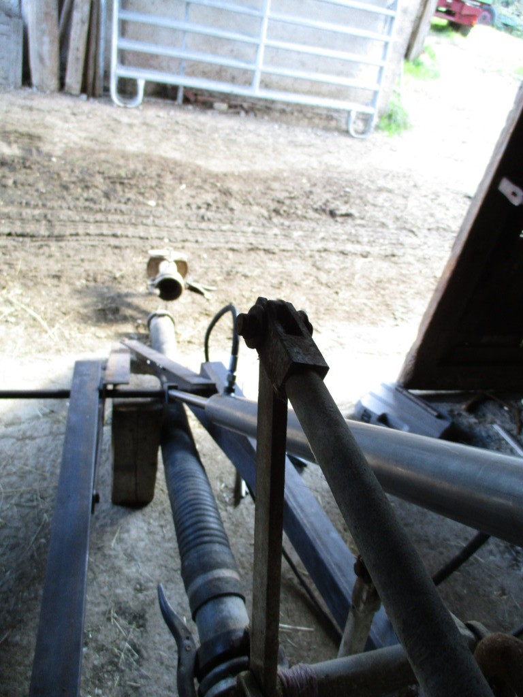
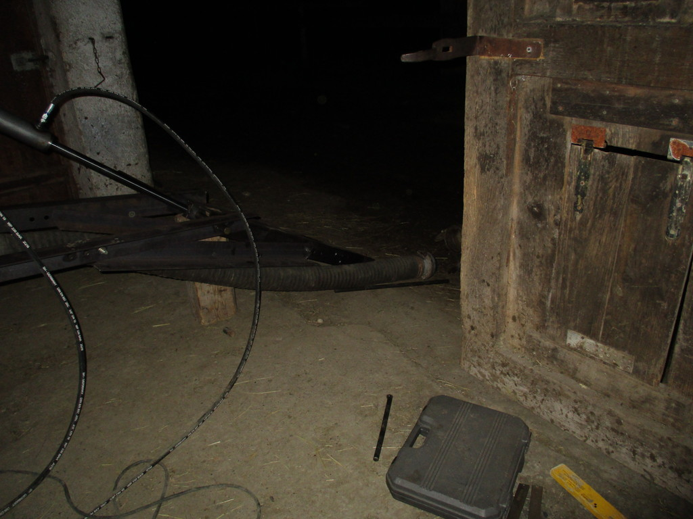
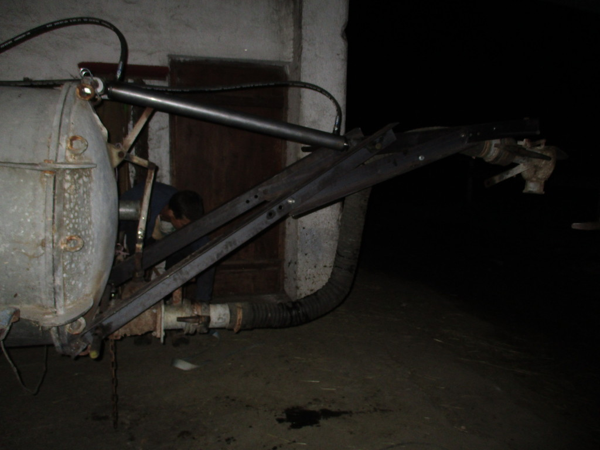

Hydraulic swan neck
===

Solution for:
---
* sucking in fluids
* delivering fluids to buildings (paint, fire fight water), meadows (wet dung), ...

Requires for operation:
---
* Pulling machine of any kind with an hydraulic pump and hydraulic fluid
* Operator
* Extra Navigator or Camera or a big enough spot to suck fluid in or a lot of time to exit, take a look, enter and act (and all over again)

Pictures (revision 1)
---

Operators

Developers Jan & Finn (alias Pettersson & Findus)

