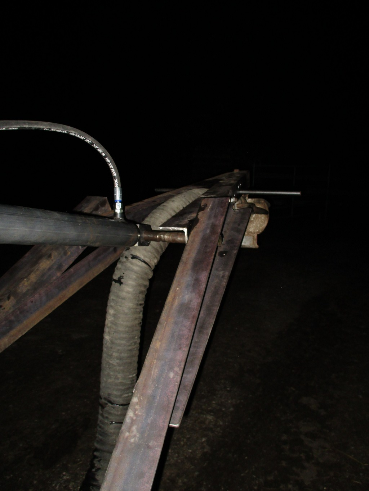

Hydraulic swan neck
===

What
---
* Hydraulic arm construction
* Flexible holder for a <a href="fluid_spreading_attachment.jpg">flipped sheet metal</a> at exit to spray downwards instead of illegal upwards direction (aim: drops instead of gases).

Solution for function(s):
---
* sucking in fluids
* delivering fluids to buildings (paint, fire fight water), meadows (wet dung), ...

Solution for environmental issues:
---
* Meeting EU agricultural regulations by modifying a now illegal tank up and wide spraying vehicle or when only one opening (exit and entry at the same time) is available.
* Being forced to have attached a fixed / static swan neck (~700€) and cut a new hole and pipe interface for sucking in fluids (sounds expensive, huh?). (There is a small version too, costing ~300€).

Requires for operation:
---
* Pulling machine of any kind with an hydraulic pump and hydraulic fluid
* Operator
* Extra Navigator or Camera or a big enough spot to suck fluid in or a lot of time to exit, take a look, enter and act (and all over again)

Pictures (revision 1)
---

Developers Jan & Finn (alias Pettersson & Findus)

